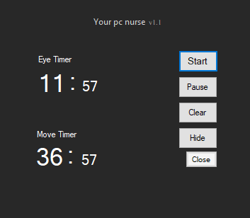

# YourPcNurse
<<<<<<< HEAD
For those who stay at the computer for a long time, a reminder of eye rest and movement health application
=======
For those who stay at the computer for a long time, a reminder of eye rest and movement health application -EN
 
 
Uzun süre bilgisayar başında kalanlar için göz istirahati ve hareket sağlığı hatırlatması uygulaması -TR
 
<h2>Description of Application</h2>

Notification for eye rest every 25 minutes and body movement every 55 minutes
it will come off. You can also view the amount of time you have worked through the System Tray.

<h2>Main View</h2>

<h2>Notifications Views</h2>

&nbsp;&nbsp;

<h2>ContextMenu View</h2>

<h2>Supported Platforms</h2>
<ul>
<li>Windows</li>
</ul>
<h2>License</h2>
<a href="LICENSE">MIT</a>
>>>>>>> 46d2ed00d4d7c23dd5da3a0d9f4d2111152664d1
